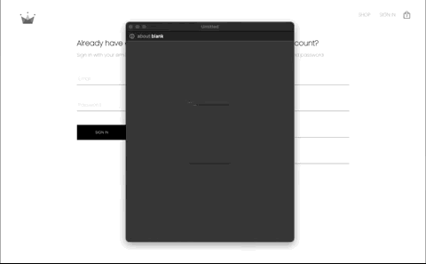
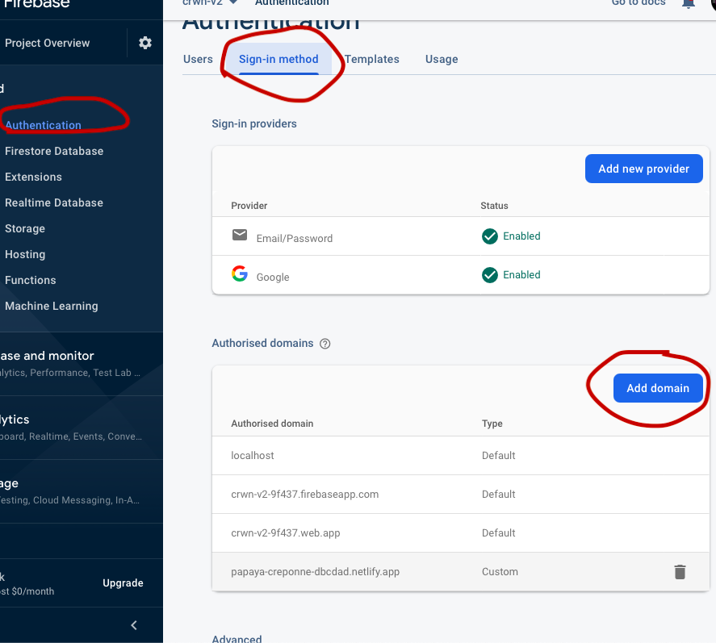

# [CRWN-CLOTHING](https://papaya-creponne-dbcdad.netlify.app/)

## Preview


## About this project

This is an ecommerce frontend project build with React CRA.
We use styled-components (css in javascript ) for the styling. Firebase for our authentication, sign in with google and user/product data storage. And context api for state management, but you can use redux if you wish.
<br />

#### Features

- A simple navigation bar, to go through different routes using the latest React-Router-Dom V6 method.
- A directory preview with all the product available inside the home page. Uppon clicking on each directory item, you'll be redirected to the related content.
- A Sign In page...

  - A sign in with Google method. As you sign in with google, you'll be automatically registered as a new user.
  - A local Sign up option with confirm password.
  - If you registered with google sign in or through the local register option. You will be able to sign in with email and password.

    

- Add to cart function. Add any item and it will show up in your cart.
- A cart dropdown preview. You'll be able to see all the items you've added to your cart. A number of your total items will appear in the shop icon. And you'll be able to scroll through the cart dropdown.
- A checkout page. All the items that you've added will automatically show on the checkout page. You can increase or decrease the number of the item and the price will automatically be updated. And you can remove the product.
- Shop Page will display all the categories with 4 items of each category for preview. If you click on any of the categories, it will redirect to the individual category and display more related products.
- Redux Persist: Redux Persist is a tool that allows us to persist our reducer values inside of local storage. Through this, we're able to actually retain the initial state that the user previously had. If you refresh the page, your cart items will persist/remain.

## How to fork and clone:

You can see the fork button in the top right corner of every GitHub project; click it and a copy of the project will be added to your GitHub profile under the same name as the original project.

## After you fork and clone:

## Install dependencies

In your terminal after you clone your project down, remember to run either `yarn` or `npm install` to build all the dependencies in the project. And then yarn/npm start to load the project.

## Set your firebase config

Remember to replace the config variable in your firebase.utils.js with your own config object from the firebase dashboard! Navigate to the project settings gear icon > project settings and scroll down to the config code. Copy the object in the code and replace the variable in your cloned code.


## Build & Deploy

If you wish to deploy with [Netlify](https://www.netlify.com)

```
1. Create or don't delete the _redirect file inside public folder. The code inside will help with the refresh of the page to redirect correctly.
2. Update the netlify domain on your firebase authentication. So the sign in feature will work.
```



#### Dependencies Ref

- [styled-components](https://styled-components.com)
- [sass](https://sass-lang.com)
- [Firebase](https://firebase.google.com)
- [React Router V6](https://reactrouter.com)

## License

```
MIT License

Copyright (c) 2021 Shay Asanova

Permission is hereby granted, free of charge, to any person obtaining a copy
of this software and associated documentation files (the "Software"), to deal
in the Software without restriction, including without limitation the rights
to use, copy, modify, merge, publish, distribute, sublicense, and/or sell
copies of the Software, and to permit persons to whom the Software is
furnished to do so, subject to the following conditions:

The above copyright notice and this permission notice shall be included in all
copies or substantial portions of the Software.

THE SOFTWARE IS PROVIDED "AS IS", WITHOUT WARRANTY OF ANY KIND, EXPRESS OR
IMPLIED, INCLUDING BUT NOT LIMITED TO THE WARRANTIES OF MERCHANTABILITY,
FITNESS FOR A PARTICULAR PURPOSE AND NONINFRINGEMENT. IN NO EVENT SHALL THE
AUTHORS OR COPYRIGHT HOLDERS BE LIABLE FOR ANY CLAIM, DAMAGES OR OTHER
LIABILITY, WHETHER IN AN ACTION OF CONTRACT, TORT OR OTHERWISE, ARISING FROM,
OUT OF OR IN CONNECTION WITH THE SOFTWARE OR THE USE OR OTHER DEALINGS IN THE
SOFTWARE.
```

## Contact

shay[dot]asanova[at]gmail[dot]com
